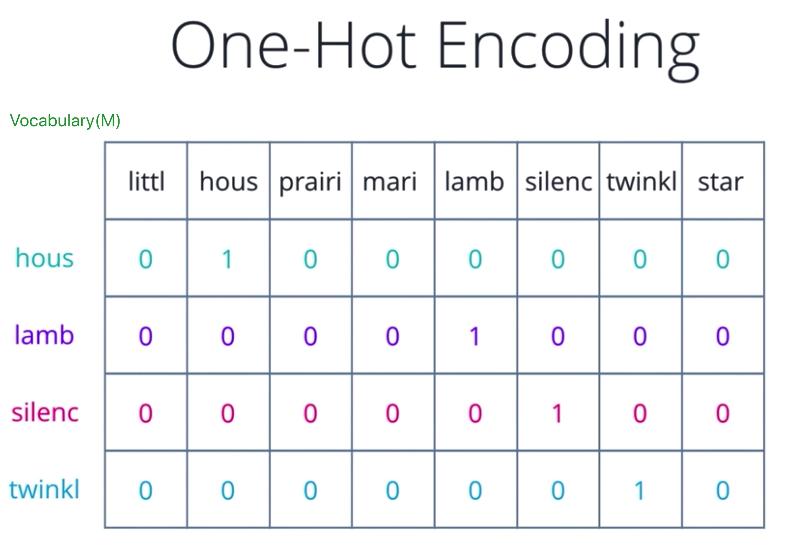
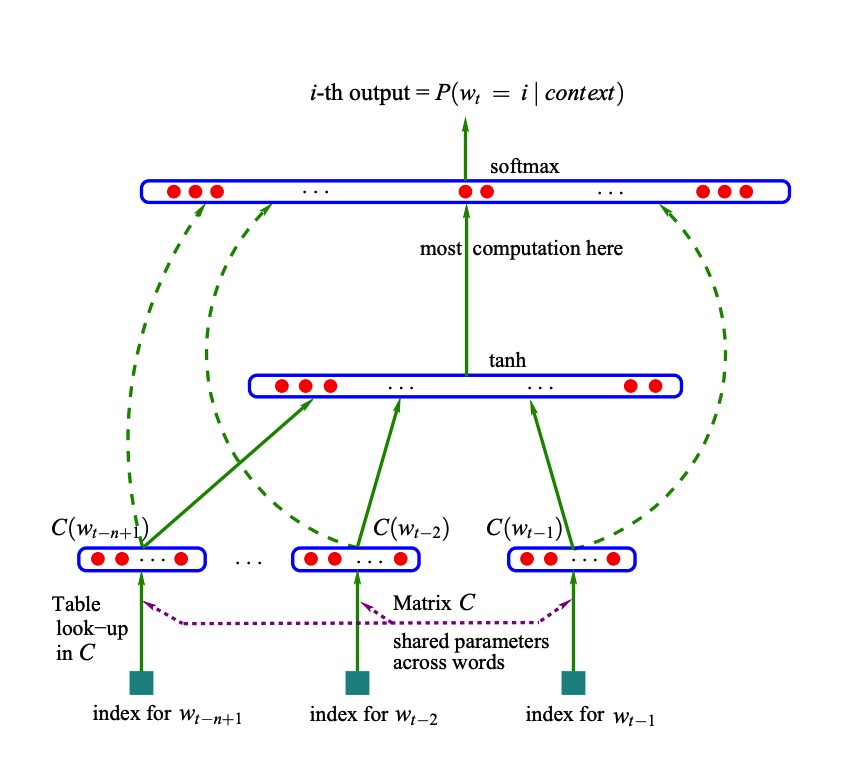
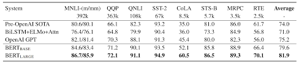
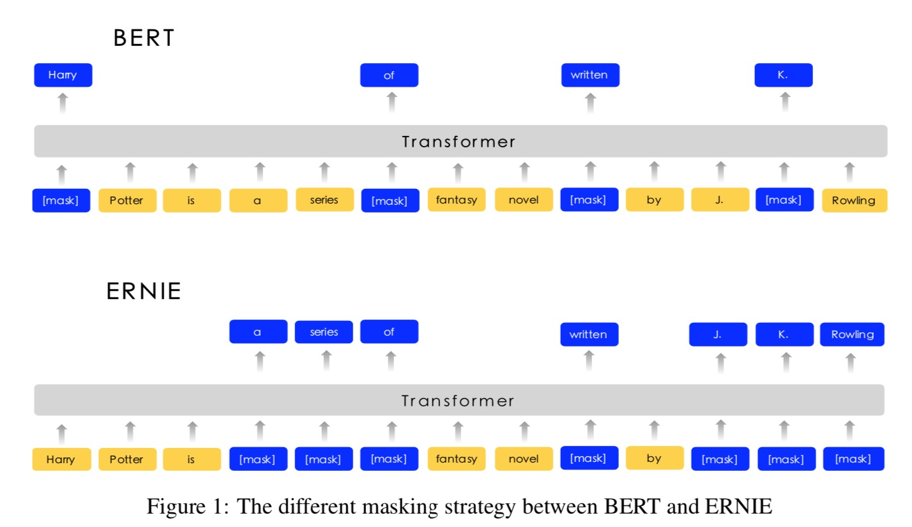

# Representation 学习笔记

>最近在学习Bert和Ernie，顺带的想回顾一下Representation的发展史，以当前的视角对之前的这些技术做些总结和思考。

Representation的实质是将文本转化为多种特征的描述，从而能从更多纬度、层次表达丰富、准确的含义。

## One-hot Encoding

有人叫独热编码（哑变量），但是感觉很奇怪，还是叫One-hot比较好。这是一种最早开始使用的字符级表示方法，想法非常的朴素和实用。
根据当前要使用的语料库，建立一个词典(Vocabulary)。对于要表示的语句，查找单个token在词典中的位置，如果是则当前位置置为1。
经过这样的转换，所有的文本，都可以转换成一个转换成一个1*M维的向量。

优点：解决了分类器不好处理分类数据的问题，在一定程度上也起到了扩充特征的作用。简单、易用。

缺点：丢失了文本间的序列信息，丢失文本出现次数信息，当类别的数量很多时，特征空间会变得非常大，容易造成维度灾难。

## Word Embedding(2013)
embedding是个神奇的东西，在刚开始学习的时候，真的是没有办法理解什么是embedding，词嵌入，纳尼！

为了能弄明白，还是看看它是怎么来的吧。

Word Embedding是个很久远的东西了，最早是由Bengio大神在2003年发表的NNLM网络结构中提到的，当时它只是个副产品。
这个模型的主要作用，就是后来大名鼎鼎的"神经网络语言模型"。这个模型虽然生的很早，但是被世人知道实在2013年了，
经历10年沉冤，最后得以昭雪（是不是很多伟大的著作都是这样），附上大神的论文[A Neural Probabilistic Language Model](http://www.jmlr.org/papers/volume3/bengio03a/bengio03a.pdf)，
有兴趣可以看看，这里就不过多介绍了。

模型长成上面这个样子，我们看到的C(W)就是Word Embedding的值，那么这个值是怎么来的呢？这个值是由任意单词W用one-hot编码后，

得到一个1 * M维的矩阵，乘以神经网络的权重矩阵Q得到的，这个Q是一个M * 1维的矩阵（Q的值是模型学习到的），
那么以后我们想要使用embedding的时候，就用one-hot乘以这个矩阵就可以了。

2013年就有人使用这种网络结构做了word embedding的工具，名叫Word2Vec（这个工具可能在今天还有人在用呢），这个工具使用的
网络和NNLM基本是一样的，唯一的不同是训练方法不同。Word2Vec有两种训练方法，一种叫CBOW，核心的思想是从一个句子里面把一个词扣掉，
用这个词的上下文，去预测这个被扣掉的词；第二种叫做Skip-gram，和CBOW正好反过来，输入某个单词，要求网络预测它的上下文单词。
而回头看看，NNLM是使用单词的上文去预测这个单词。那为什么Word2Vec要这么处理呢，这事因为任务目的的不同。NNLM的主要目的是用来做语言模型，
语言模型的任务就是从根据上文来预测下文，而word embedding只是一个副产品；但是Word2Vec的目标就是要word embedding，这是主产品。

那为什么要叫embedding这个'奇怪'的名字呢？这里有两个解释，第一个是因为实现方式，上文说的CBOW方法，是使用被扣掉词的上下文来预测被扣掉的词，
那这个被扣掉的词就好像被嵌入到上下文中间一样，所以起名embedding；还有一种解释是因为embedding是一个数学名词，
它表示的是一种结构化映射,具体可以参考wiki上的解释[embedding](https://en.wikipedia.org/wiki/Embedding)。我更倾向与第二种，
因为word embedding的这种方式，确实能在更高的纬度上给出一些词性、语意上的解释。例如下图中，我们可以看到，
很多词性、语意相近的词语会被聚类到一起。

那么有了这个embedding后，我们怎么用呢？这里我们要插入点图像领域'迁移学习(Transfer learning)'的知识了。有人可能会问这和图像领域有什么关系？
由于深度学习技术应用在图像领域要比应用到nlp领域早不少，所以有很多nlp领域的做法都是从图像领域借鉴而来的，我们nlp的预训练技术也是如此。

附上Word2Vec的paper地址，方便大家去查看细节，[Distributed Representations of Words and Phrases and their Compositionality](https://papers.nips.cc/paper/5021-distributed-representations-of-words-and-phrases-and-their-compositionality.pdf)。

### 迁移学习
跟传统的机器学习算法相比，深度学习的劣势是什么？一个字，贵！在我们进行很多图像、声音的任务时，我们需要非常大的网络模型和超大规模的数据来进行训练，
为了训练好这样的模型，我们势必要消耗大量的时间和计算资源。那如果我们每次训练都要花费这么长的时间，深度学习技术的发展得是多么的缓慢。
所以在图像领域就有人就想出，可不可以借用之前训练过的模型，继续训练呢？答案当然是肯定的。

就像上图看到的，越是接近输入的层（低层），探测到的都是一些比较低级别的特征，比如说图像边缘的曲线、某种条纹等；而越是接近输出层，则识别到的都是更接近
任务最终目标的的图像，比如说上图的这个任务是给图片进行分类，那么最终层（高层）所探测到的这些特征就已经非常的接近完整的类别图像了，比如说狗、人、花等。
因为大部分的任务对于低级别的特征都是很相似的，就没有必要每次都重新训练了，我们直接拿过来大公司使用大型网络和数据训练出来的预训练模型，
直接用，又快，又好！

说到这里，就不得不继续说说该怎么用。大体上有两种方法。

首先使用预训练模型中的参数来初始化想要训练模型的低层参数，后面的参数重新随机初始化。

第一种，Frozen Transfer Learning
把使用预训练模型的初始化的低层参数冰冻(Freeze)上，然后使用数据训练后面随机初始化的网络参数。

第二种，Fine-tuning
不冰冻使用预训练模型的初始化的低层参数，使用数据训练整个网络的参数。

这里对于迁移学习的描述比较简单，如果对迁移学习感兴趣，可以去看看这篇论文[A Survey on Deep Transfer Learning](https://arxiv.org/pdf/1808.01974.pdf)
或者去读下这篇文章[A Comprehensive Hands-on Guide to Transfer Learning with Real-World Applications in Deep Learning](https://towardsdatascience.com/a-comprehensive-hands-on-guide-to-transfer-learning-with-real-world-applications-in-deep-learning-212bf3b2f27a).

介绍完迁移学习，我们继续nlp的话题。这么好的方法，当然有前辈给借鉴过来了，迁移学习的思路在nlp的任务上也同样适用。之前我们说到的embedding
矩阵Q，就是one-hot到embedding层的初始化参数。是不是很cool，这样我们就把word embedding用起来了。

优点：从one-hot encoding这种稀疏矩阵，转变成了一种稠密矩阵，降低了纬度。并且表示的向量能够在高维度中有很好的解释性。

缺点：word embedding是一个静态的编码模型，一个词不管出现在什么样的上下文中，它的编码结果都是不变的。这样在面对很多多义词时就表达的不准确了。
比如说'苹果'，在不同的上下文分别可以表示水果、公司、手机、电影、歌曲等；还有一点是word embedding是一个词级别的模型，对于像中文这种就会非常
依赖分词的准确性。

## ELMO(2018.02)
艾蒙（英语：Elmo）是一名虚构布偶角色，主要登场于美国儿童电视节目《芝麻街》中的多部短剧中。艾蒙是只的红色绒毛怪兽。长成下面这样。

研究人员还是很有童心的。言归正传，ELMO的全称是"Embedding from Language Models",感觉这个名字并没有反应初它的核心思想，
提出ELMO的论文题目"Deep contextualized word representation"更能体现其精髓，contextualized是这这算法中最本质的思想。
我们之前有说过，word embedding是一种静态的方式，就是每个单词的表达是固化的，不管上下文怎么变化，这个词的表示都是这样子的。
这种表示方式是很不合理的，那ELMO要解决的问题就是，每个单词在不同的上下文下，能够有准确表达其在上下文中含义的表示。

ELMO的网络结构如上图所示，选用的主要特征抽取器是LSTM，任务的目的是通过W的上下文来预测W。 W之前的单词序列Context-before称为上文，
之后的单词序列Context-after称为下文。图中左端的前向双层LSTM代表正方向编码器，输入的是从左到右顺序的除了预测单词外W的上文Context-before；
右端的逆向双层LSTM代表反方向编码器，输入的是从右到左的逆序的句子下文Context-after；每个编码器的深度都是两层LSTM叠加。我们使用大量
语料训练好这个网络，输入新的句子的时候，我们就能从这个网络中得到三个有效的矩阵，分别对应着模型的embedding层、layer #1和layer #2。
如果我们从更高纬度去观察这三层，就会知道这三层分别对应着单词特征、句法特征、语义特征（跟迁移学习中说的图像的例子很像，就像上图看到的，
越是接近输入的层（低层），探测到的都是一些比较低级别的特征；而越是接近输出层，则识别到的都是更接近任务最终目标的的图像，
比如说上图的这个任务是给图片进行分类，那么最终层（高层）所探测到的这些特征就已经非常的接近完整的类别图像了）。OK，有了这三个矩阵，
我们就可以进行下游任务的训练了。

ELMO进行下游训练时，采用了一种双向拼接的方式。首先把三个矩阵的前向和后向矩阵拼接起来，然后给三个矩阵分别增加一个参数s0、s1和s2（这三个权重
值可以根据后续的学习获得），然后对这三个矩阵进行自权重累加求和，整合成一个矩阵。这个矩阵就作为后续任务的补充特征提供给下游任务使用。

优点：ELMO将word embedding这种静态表示变成了一种动态的方式，很好的解决了多义词的问题，并且捕获了更多高纬度的语法、语义信息。

缺点：LSTM的特征提取能力不够强大；这种双向拼接的融合方式，对于特征的融合能力不够好。

附上ELMO的paper地址，方便大家去查看细节，[Deep contextualized word representations](https://arxiv.org/pdf/1802.05365.pdf)。

## GPT(2018)

GPT是“Generative Pre-Training”的简称，上图是该模型的网络结构，把Transformer Block当成一个整体看的话，其实这个模型跟ELMO很相似，
大体上的思路就是把原来的LSTM换成了Transformer了。有关Transformer的讨论有点超出本篇的范围了，大概介绍就是，Transformer是Google在2017年
[Attention Is All You Need](https://arxiv.org/pdf/1706.03762.pdf)这篇论文中提到的，这种新的特征抽取器一下子受到了很多研究者的关注，
有很多研究已经证明了Transformer的特征提取能力要远强预LSTM。这里有两篇文章很好的介绍这种结构，可以配套论文参看
[The Illustrated Transformer](https://jalammar.github.io/illustrated-transformer/)和[The Annotated Transformer](http://nlp.seas.harvard.edu/2018/04/03/attention.html)。

相比预ELMO，预训练中的网络结构GPT首先使用Transformer更换掉了ELMO的LSTM，这里有一点我有点想不通，为什么GPT把原来的双向预测的结构，
换成了单向的，只有前向的网络丢失很多能够捕获的信息，同样也给Bert送了一个超级大礼。针对下游任务应用ELMO的双向拼接的方式，GPT使用了FIne-tuning
这种融合能力更强的方式，这跟图像领域的迁移学习已经一毛一样了。然后我们剩下的问题就是，怎么才能把NLP的各种各样的花式任务改造成GPT的网络结构。

上图就是GPT论文中给出的答案，对于不同的任务，改造输入部分，这样就能够在不改变网络模型的前提下，完成各种任务了。

优点：更强的特征抽取器，可以捕捉到更长范围的信息，计算速度比循环神经网络更快，易于并行化；更好的特征融合方式

缺点：单向的预测模型，不太会炒作

附上GPT的paper地址，方便大家去查看细节，[Improving Language Understanding by Generative Pre-Training](https://s3-us-west-2.amazonaws.com/openai-assets/research-covers/language-unsupervised/language_understanding_paper.pdf)。

## Bert(2018.10)
这个名字和ELMO一样，也是用《芝麻街》中的卡通星形象命名的，研究人员太顽皮了，卡通形象长成下面这个样子。

Bert的网络结构和GPT大体上是一致的，只是把前文说的单向的结构更换成了双向的Transformer结构，所以在网络结构方面就不多说了。在Fine-tuning阶段，
Bert也采用了和GPT大体一致的做法，只是在有些任务改造的细节上略有不同。下面是Bert论文中给出的针对不同的任务的改造方法。

那么，Bert和GPT的区别在哪里？为什么Bert取得了比GPT更好的效果？下面这张图是研究人员做的有效因子分析，从这里可以看出双向的预测结构对模型的影响
是最大的，同时增加的next sentence prediction task也对模型的效果有着明显的影响。

有关Bert宏观上的认识就说到这里了，因为Bert目前在多个NLP的任务上取得SOTA的成绩，所以我们要展开的说一说Bert模型的一些细节。
首先让我们来看看Bert是怎样实现的双向语言模型，我们前文有说过，ELMO是用两个LSTM网络，一个负责前向、一个负责后向，那同理也可以推广到用两个
Transformer，一个负责前向、一个负责后向。我觉得这样做应该也是可以的，但是可能会使整个结构变得非常的大，Bert采用了一种更"巧妙"的方式来实现的
双向语言模型。

我们之前有提到过CBOW，思路是我们把要预测的单词抠掉，然后根据它的上文Context-Before和下文Context-after去预测单词。Bert就是这样做的，
虽然作者说他的灵感是来源于完形填空，但这两种思路是一致的。论文的作者把这个叫做Masked语言模型，具体的实现细节是这样的：
随机选择语料中15%的单词，把它抠掉，也就是用[Mask]掩码代替原始单词，然后要求模型去正确预测被抠掉的单词。
但是这里有个问题：训练过程大量看到[mask]标记，但是真正后面用的时候是不会有这个标记的，这会引导模型认为输出是针对[mask]这个标记的，
但是实际使用又见不到这个标记，这自然会有问题。为了避免这个问题，Bert改造了一下，15%的被上天选中要执行[mask]替身这项光荣任务的单词中，
只有80%真正被替换成[mask]标记，10%被狸猫换太子随机替换成另外一个单词，10%情况这个单词还待在原地不做改动。Masted Language Model
是下图这个样子的。Position embedding是为了让Transformer确定时序用的。

Bert还有个比较独特的东西就是Next Sentence Prediction(NSP)，其实上文有提到过。这个东西就是做语言模型预训练的时候，
分两种情况选择两个句子，一种是选择语料中真正顺序相连的两个句子；另外一种是第二个句子从语料库中抛色子，随机选择一个拼到第一个句子后面。
我们要求模型除了做上述的Masked语言模型任务外，附带再做个句子关系预测，判断第二个句子是不是真的是第一个句子的后续句子。
之所以这么做，是考虑到很多NLP任务是句子关系判断任务，单词预测粒度的训练到不了句子关系这个层级，增加这个任务有助于下游句子关系判断任务。
所以可以看到，它的预训练是个多任务过程。

最后，让我们来看看Bert的效果。

只能说，赶紧去把之前的算法改成Bert版的吧。

优点：效果好，适用性强

附上Bert的paper地址，方便大家去查看细节，[BERT: Pre-training of Deep Bidirectional Transformers for Language Understanding](https://arxiv.org/pdf/1810.04805.pdf)。

## Ernie

上图左面的这个就是Ernie，没错，你没看错，右边那个是Bert，《芝麻街》的作者说他俩其实是couple。WTF，百度的同学，有点恶搞啊。
Ernie来自于百度，主要是在Bert的基础上，增添了一些知识增强的工作。在百度放出的对于中文的nlp任务上的结果，全面超过了Bert。

那让我们来具体说说百度是怎么做的。百度这个工作的主要想法是，希望能把知识图谱融入到语言模型中，因为之前说Bert的时候，Transformer特征抽取器
在学习语言特征的时候，这其中就可能包含一部分"知识图谱"相关的知识，比如说"相对论理论是由爱因斯坦创立的"这种。但是由于这个网络的任务毕竟不是
学习知识图谱，所以对于这种类型的特征的抽取能力并不太强。那么Ernie就是强行让"Transformer"强行学会知识图谱相关的知识。
那么具体怎么做呢？

如上图所示，预训练阶段仍旧采取字输入，但是Mask对象是单词，这些单词里面可能有百度多年沉下来的实体词，使用这种方式"强迫"网络学会知识图谱的信息。
还有就是，百度使用了更多的中文语料对模型进行训练。我的理解是，Ernie实质上还是一个多任务的模型，跟Bert把NSP融入的模型中有着相似的思路。
可以预见，多任务训练可能是将来很重要的一个研究方向。

附上Ernie的paper地址，方便大家去查看细节，[ERNIE: Enhanced Representation through Knowledge Integration](https://arxiv.org/pdf/1904.09223.pdf)。
 
## Future
1 更强大的特征抽取器
2 更高质量、更大规模的模型
3 多任务训练

